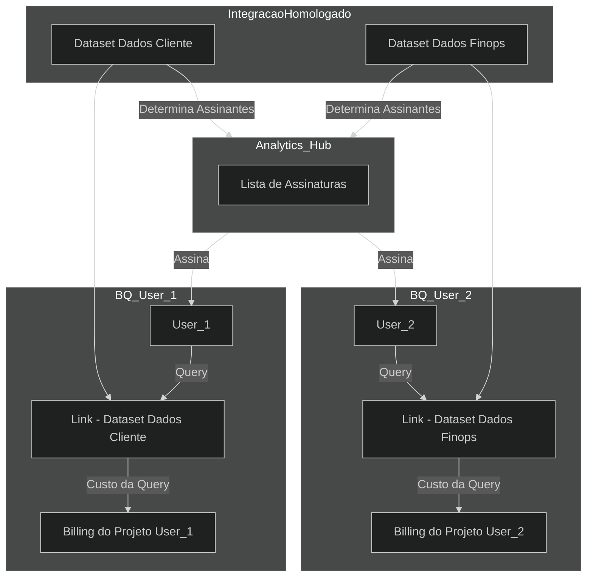

***Lucas Leite - FinOps 404***

# Analytics Hub
O Analytics Hub permite que usuários e organizações compartilhem e acessem conjuntos de dados de forma segura e eficiente, promovendo uma cultura de colaboração em análise de dados.  
Esse compartilhamento permite que o custo gerado pelo usuário num dataset seja direcionado ao projeto do usuário e não ao projeto do dataset.  
Exemplo:
* Dentro de um projeto **X** os existe o dataset de dados de **dados cliente**,
* O usuário do projeto **Y** precisa acessar **dados cliente** para realizar uma query e gerar uma **view**,
* No **Analytics Hub** é possivel determinar quem pode acessar o dataset **dados cliente** do projeto **X**,
* Então o usuário do projeto **Y** pode acessar o dataset **dados cliente** via BigQuery definindo o Analytics Hub como fonte dos dados,
* Porém durante a integração da fonte de dados o usuário precisa definir o projeto em que será adicionado os custos, ou seja, o projeto **Y** ao qual está associado.
* A partir disso, todas as querys que o usuário do projeto **Y** realizar no dataset **dados cliente** do projeto **X**, será cobrado no billing do projeto **Y** onde o usuário está alocado.

## Caso de uso Analytics Hub (Ambiente Mockado)
Dada a situação do ambiente de dados mockados FINOPS 404, foi realizada a idealização de uma estrutura centralizada dos dados, na qual os mesmo são distribuidos para as partes de interesse. Ou seja:

* **IntegracaoHomologado -** Possui todos os datasets da Organização.

* **BigQuery User 1 -** Possui acesso apenas aos datasets associados a ele pelo **Analytics Hub**, e o **custo** vai para o **projeto do User 1** (permissões de uso do BigQuery determinado por permissões, IAM, etc).

* **BigQuery User 2 -** Possui acesso apenas aos datasets associados a ele pelo **Analytics Hub**, e o **custo** vai para o **projeto do User 2** (permissões de uso do BigQuery determinado por permissões, IAM, etc).  
 
 

